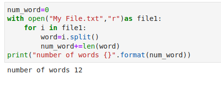

# Word-count
## AIM:
To write a python program for getting the word count from a text.
## EQUIPEMENT'S REQUIRED: 
PC
Anaconda - Python 3.7
## ALGORITHM: 

### Step 1: 
assign value for num_word
### Step 2: 
open the file in read mode
### Step 3:  
iterate using for loop
### Step 4: 
increment the word with length of the word
### Step 5: 
print the number of words in text

## PROGRAM:
```python
##developed by: Rasika.M
#register number: 22005459

num_word=0
with open("My File.txt","r")as file1:
    for i in file1:
        word=i.split()
        num_word+=len(word)
print("number of words {}".format(num_word))
```
### OUTPUT:



## RESULT:
Thus the program is written to find the word count from a text.
